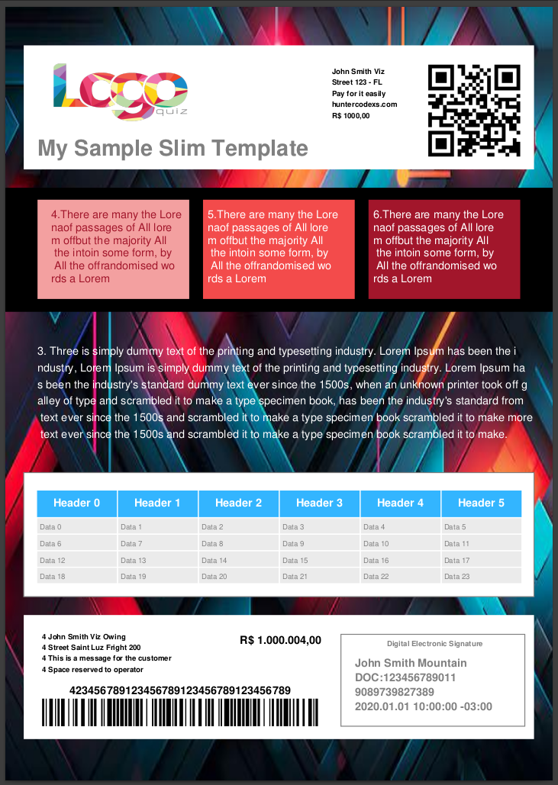
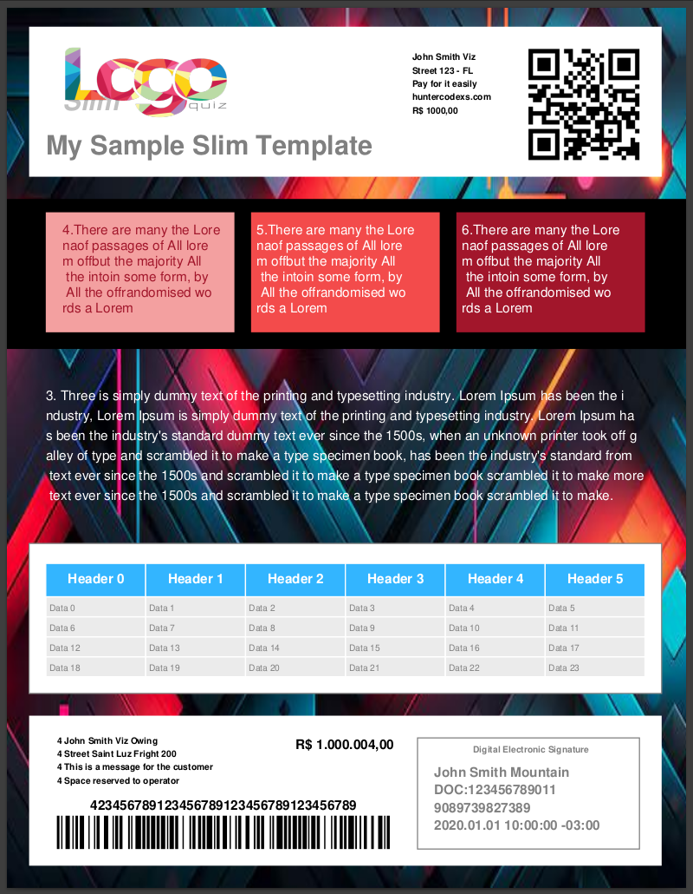
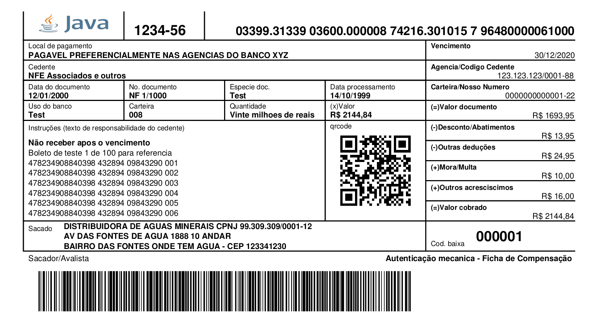

# JEASYPDF
A simple project to create pdf file based on pdf-box

## Overview

#### Templates

- Box
- Box Open
- Slim
- Slim Box
- Big Burger
- Header Body
- Triple Fall
- Free

## How to Use

Follow the URL https://github.com/huntercodexs/jeasypdf/tree/release-1.8.0/src/test/java/com/huntercodexs/jeasy to 
get all tests available for this simple library.

With this library, you can generate a:

- Barcode Form (for bills)
- PDF Document (A4, LETTER)
- Convert images to PDF
- Convert PDF to images
- Merge file into a single PDF
- Split one single PDF file into separated files
- Scan one PDF file to read barcode values
- Etc...

## Examples

- Slim Template A4

- Slim Template LETTER

- Barcode Form

## Releases

**Release 1.8.0**
 
<a href="https://github.com/huntercodexs/jeasypdf/releases/tag/r.1.8.0">
Java 8 - 1.8.0-SNAPSHOT (BETA)
</a>

